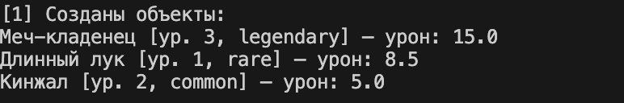
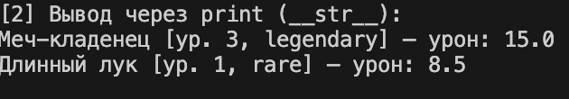
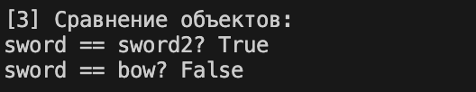
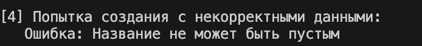
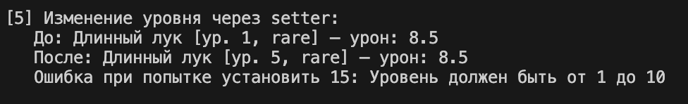
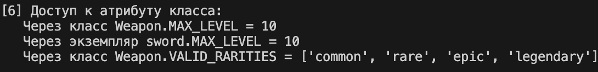
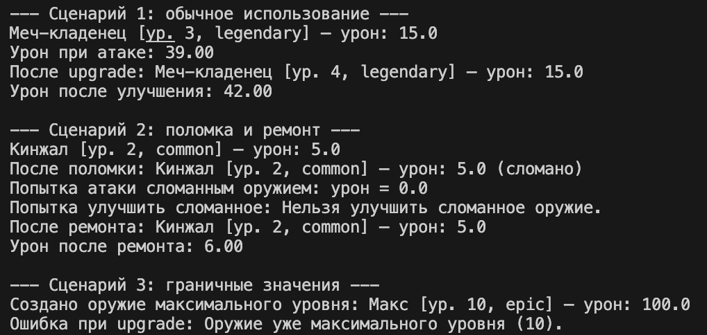

```py
# python2
Описание проекта

В этом проекте представлена реализация класса Weapon на языке Python, который моделирует игровое оружие. Класс хранит информацию о названии, базовом уроне, редкости, уровне и состоянии целостности (сломано / не сломано), а также предоставляет методы для изменения этих данных с обязательной валидацией.

Проверки вынесены в отдельный модуль validate.py. В файле demo.py приведены несколько сценариев использования класса и демонстрация его основных возможностей.

Создание класса

При разработке класса Weapon были учтены следующие соображения:

Определение сущности «оружие»

Необходимо было выделить ключевые характеристики игрового оружия:
name — название (строка, не может быть пустой)
damage — базовый урон (число ≥ 0)
rarity — редкость (строка, только common, rare, epic, legendary)
level — уровень оружия (целое число от 1 до MAX_LEVEL)
is_broken — состояние целостности (булево значение: True – сломано, False – исправно)
Инкапсуляция и контроль доступа

Чтобы избежать некорректного изменения данных:

все атрибуты сделаны приватными (_name, _damage и т.д.)
доступ осуществляется через @property
изменение значений проходит через setter’ы с валидацией и учётом состояния оружия (нельзя менять уровень сломанного оружия)
Валидация данных

Для соблюдения принципа разделения ответственности:

вся валидация вынесена в validate.py
каждая функция отвечает за один атрибут (название, урон, редкость, уровень)
при ошибке выбрасывается TypeError или ValueError

Бизнес-логика

Реализованы методы, отражающие поведение оружия:

upgrade() — повышает уровень на 1 (если оружие не сломано и не достигнут максимум)
repair() — чинит оружие (снимает статус is_broken)
break_weapon() — искусственно ломает оружие (для демонстрации)
attack() — рассчитывает итоговый урон с учётом уровня, редкости и состояния (сломанное оружие даёт 0 урона)
Логическое состояние

Оружие может находиться в одном из двух состояний:

is_broken = False — исправно, все операции доступны
is_broken = True — сломано, запрещены:

атака (возвращает 0)
улучшение (upgrade())
изменение уровня (сеттер level выбрасывает исключение)
Магические методы

Для удобства реализованы:

__str__ — красивый вывод оружия с указанием статуса (сломано / исправно)
__repr__ — техническое представление для отладки
__eq__ — сравнение оружия по всем значимым характеристикам (название, урон, редкость, уровень)
Обработка исключений

В demo.py показаны ситуации, где:

вводятся некорректные данные (пустое название, отрицательный урон, недопустимая редкость)
выполняются запрещённые действия (улучшение сломанного оружия, превышение максимального уровня)
Исключения перехватываются и выводятся пользователю.
Сценарии работы программы

Сценарий 1 — Создание объектов

Создаются несколько объектов оружия с корректными параметрами. При создании вызываются функции валидации.
Демонстрирует: корректную инициализацию, работу конструктора.



Сценарий 2 — Вывод (__str__ и __repr__)

Оружие выводится через print() (используется __str__).
Демонстрирует: разные форматы представления объекта.



Сценарий 3 — Сравнение объектов (__eq__)

Сравниваются два оружия с одинаковыми и разными характеристиками.
Демонстрирует: правильность переопределённого метода __eq__.




Сценарий 4 — Некорректное создание (обработка исключений)

Попытка создать оружие с пустым названием, отрицательным уроном или недопустимой редкостью.
Демонстрирует: работу валидации, защиту от неверных данных.




Сценарий 5 — Изменение уровня через setter

Уровень оружия изменяется через свойство level (с валидацией и проверкой состояния).
Демонстрирует: безопасное изменение данных, контроль со стороны сеттера.




Сценарий 6 — Доступ к атрибутам класса

Выводятся значения атрибутов класса MAX_LEVEL и VALID_RARITIES как через сам класс, так и через экземпляр.
Демонстрирует: понимание принадлежности атрибутов классу.




Сценарий 7 — Бизнес-методы и логические состояния

Обычное использование: атака, улучшение оружия, повторный расчёт урона.
Поломка и ремонт: оружие ломается (break_weapon), атака возвращает 0, улучшение и изменение уровня запрещены, после ремонта всё восстанавливается.
Граничные значения: создание оружия максимального уровня и попытка улучшить его – выброс исключения.
Демонстрирует: бизнес-логику, зависимость поведения от состояния объекта, корректную обработку ошибок.



Заключение

Данный проект демонстрирует:

-принципы ООП (инкапсуляция, сокрытие данных)
-работу с @property и сеттерами
-разделение логики на модули (валидация вынесена отдельно)
-обработку исключений и защиту от некорректного ввода
-использование магических методов (__str__, __repr__, __eq__)
-зависимость поведения объекта от его внутреннего состояния (is_broken)
```


