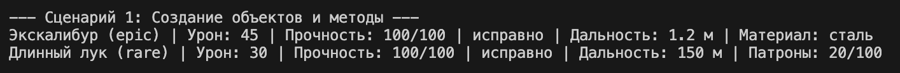
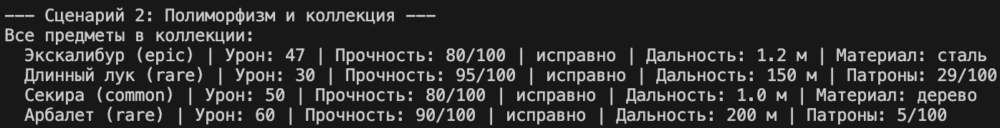
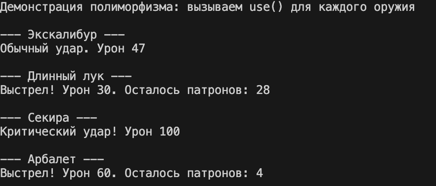
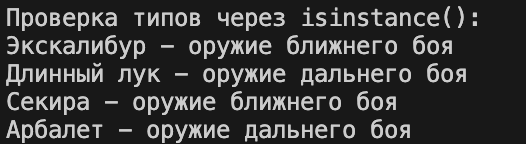
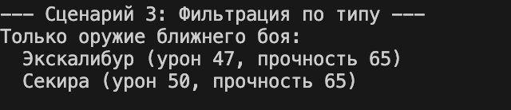
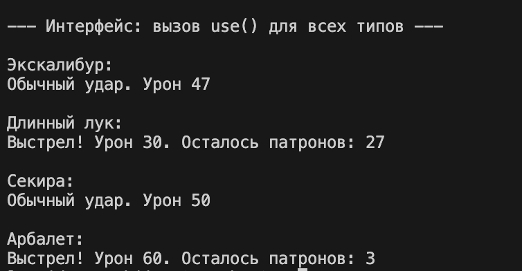

# Лабораторная работа №3: Наследование и иерархия классов (на примере `Weapon`)

## 1. Цель работы

- Освоить механизм наследования классов.
- Научиться строить иерархию объектов.
- Понять разницу между базовым и производным классами.
- Научиться переиспользовать код.
- Освоить переопределение методов.

## 2. Описание реализованной иерархии классов

### Базовый класс – `Weapon`

Атрибуты: `name`, `damage`, `durability`, `rarity`, `is_broken`.

Методы: `use()`, `repair()`.

Специальные методы: `__str__`, `__repr__`, `__eq__`.

### Производные классы

| Класс | Новые атрибуты | Новый метод | Отличия в поведении |
|-------|----------------|-------------|----------------------|
| `MeleeWeapon` (оружие ближнего боя) | `reach` (дальность удара, м), `material` (материал) | `sharpen()` – заточка (увеличивает урон на 5%, снижает прочность на 5) | Метод `use()`: прочность падает на 15 (вместо 10), 30% шанс критического удара (удвоение урона) |
| `RangedWeapon` (оружие дальнего боя) | `range` (дальность стрельбы, м), `ammo` (количество патронов) | `reload(amount)` – пополнение патронов | Метод `use()`: расходует 1 патрон, прочность падает на 5; при отсутствии патронов выбрасывает исключение |

Оба наследника используют `super().__init__()` для вызова конструктора базового класса, переопределяют методы `__str__` (добавляют специфичную информацию) и `use()` (реализуют разное поведение).

### Класс-контейнер `WeaponCollection`

Обеспечивает хранение объектов `Weapon` и его наследников, добавление, удаление, поиск, сортировку, итерацию, индексацию (унаследован из ЛР‑2, адаптирован для работы с иерархией).

## 3. Демонстрация работы (сценарии из `demo.py`)

### 1. Создание объектов

sword = MeleeWeapon("Экскалибур", 45, 100, "epic", reach=1.2, material="сталь")
bow = RangedWeapon("Длинный лук", 30, 100, "rare", range=150, ammo=20)

2. Добавление в коллекцию и содержимое коллекции

3. Полиморфизм

4. Проверка типа данных

5. Фильтрация оружия ближнего боя

6.Фильтрация оружия дальнего боя

7. Реализованные сценарии

Сценарий А: Заточка всего ближнего оружия

Перебираются объекты типа MeleeWeapon из коллекции. Для каждого вызывается метод sharpen() (увеличивает урон, снижает прочность). Выводится сообщение о результате.

Сценарий Б: Перезарядка всего дальнего оружия

Перебираются объекты типа RangedWeapon. Для каждого, у кого ammo < 30, вызывается reload(20). Выводится количество патронов после перезарядки.

Сценарий В: Поиск оружия по редкости "epic"

Фильтрация коллекции по значению атрибута rarity (без учёта регистра). Для каждого найденного оружия выводится его тип и метод use() (полиморфный).

4. Вывод

В ходе лабораторной работы были изучены и применены на практике:

Наследование – создание дочерних классов MeleeWeapon и RangedWeapon от базового Weapon с добавлением новых атрибутов и методов, переиспользование кода через super().
Полиморфизм – единый интерфейс метода use(): вызов этого метода для объектов разных типов приводит к разному поведению (ближний бой – критический удар и снижение прочности на 15; дальний бой – расход патронов и снижение прочности на 5) без использования условных операторов if type == ....
Интеграция с коллекцией – контейнер WeaponCollection из ЛР‑2 успешно хранит объекты всех типов иерархии, а фильтрация по типу (get_melee, get_ranged) позволяет получать подмножества объектов.
Инкапсуляция и валидация – сохранены из ЛР‑1, что обеспечивает корректность данных (проверки имени, урона, прочности, редкости, дальности, материала, патронов).
