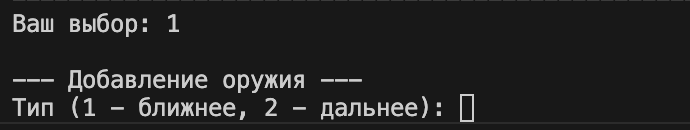
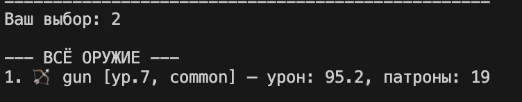
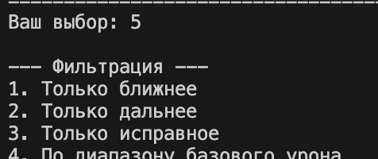
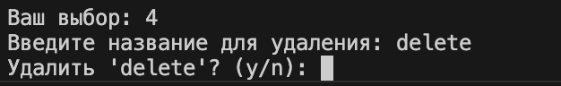
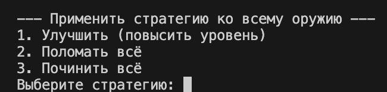

# Лабораторная работа №7 — Интеграционное приложение (CLI)

## Цель работы
Объединить все знания, полученные в ЛР1–ЛР6, в единое работающее приложение с интерактивным консольным интерфейсом (CLI). Реализовать полный цикл управления коллекцией оружия: добавление, удаление, поиск, фильтрацию, сортировку, стратегии обработки, сохранение/загрузку данных.

## Структура проекта
- `main.py` – точка входа.
- `cli.py` – консольный интерфейс (меню, ввод, вывод).
- `app.py` – бизнес-логика (работа с коллекцией, валидация, исключения).
- `models.py` – классы предметной области (Weapon, MeleeWeapon, RangedWeapon).
- `container.py` – Generic-коллекция TypedCollection.
- `strategies.py` – стратегии сортировки, фильтрации, обработки (callable).
- `validate.py` – функции валидации.
- `exceptions.py` – собственные исключения.
- `storage.py` – сохранение/загрузка в JSON.

## Описание CLI
Меню содержит пункты:
1. Добавить оружие (с выбором типа, вводом параметров)
2. Показать всё оружие
3. Найти оружие по имени
4. Удалить оружие (с подтверждением)
5. Фильтровать оружие (по типу, по исправности, по диапазону урона)
6. Сортировать оружие (по имени, урону, уровню, редкости, реальному урону)
7. Применить стратегию обработки (улучшить, поломать, починить)
0. Сохранить и выйти

Обработка ошибок:
- Неверный ввод (буквы вместо чисел) перехватывается и запрашивается повторно.
- Собственные исключения `DuplicateItemError`, `ItemNotFoundError` отображаются пользователю.
- Валидация данных при создании оружия.

## Демонстрация работы
(Скриншоты вставлены в папку `images/lab07/`)

### Сценарий 1: запуск, добавление, вывод

### Сценарий 2: удаление с подтверждением

### Сценарий 3: фильтрация по диапазону урона

### Сценарий 4: сортировка по реальному урону

### Сценарий 5: стратегия улучшения

### Сценарий 6: сохранение и повторный запуск
После выхода создаётся `weapons.json`. При повторном запуске данные загружаются автоматически.

## Вывод
В ходе работы изучено и применено:
- Разбиение кода на модули и слои (CLI, бизнес-логика, хранение).
- Реализация интерактивного CLI с меню и обработкой ошибок ввода.
- Использование собственных исключений.
- Работа с JSON для сохранения/загрузки.
- Аннотации типов и документация (docstring) для всех публичных функций.
- Паттерн «Стратегия» для сортировки, фильтрации, обработки.
- Generic-коллекция и структурная типизация (Protocol) – перенесены из ЛР6.

Приложение полностью готово к использованию.